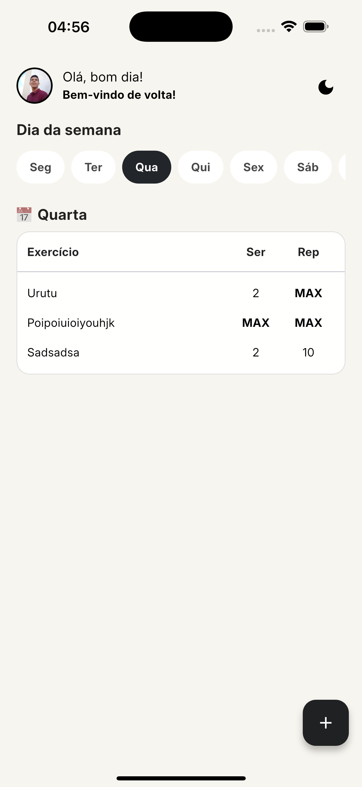
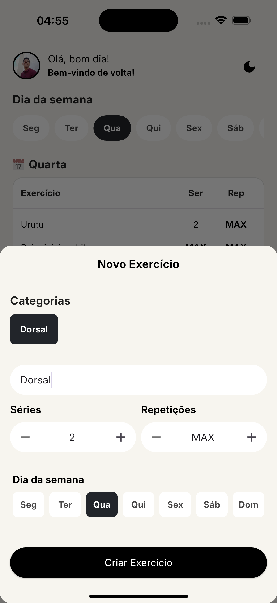

# 💪 TreinoApp

Um aplicativo mobile feito com Flutter para organização de treinos por **categoria** e **dia da semana**, com design limpo inspirado no estilo do ChatGPT.

---

## 🧭 Objetivo

O **TreinoApp** foi desenvolvido com o objetivo de facilitar o gerenciamento de rotinas de treino. Ele permite ao usuário cadastrar categorias como "Peito", "Bíceps", "Tríceps", e associar exercícios com sequência, repetições e dias da semana. A interface foi desenhada para ser leve, fluida e intuitiva.

---

## 📱 Funcionalidades

- ✅ Cadastro de categorias de treino com imagem
- ✅ Adição de exercícios com detalhes (sequência, repetições, dia)
- ✅ Visualização agrupada por **categoria** ou **dia**
- ✅ Filtro de categorias
- ✅ Modo escuro/claro com toggle
- ✅ Animação de FAB em espiral para ações rápidas
- ✅ Design responsivo e inspirado em interfaces modernas

---

## 🛠️ Tecnologias Utilizadas

| Tecnologia         | Descrição                                                   |
|--------------------|--------------------------------------------------------------|
| Flutter 🐦          | SDK para desenvolvimento mobile multiplataforma              |
| Dart 💙             | Linguagem de programação moderna, concisa e produtiva        |
| Isar Database ⚡     | Banco de dados local ultrarrápido, com suporte a Flutter/Dart |

---

## 🌙 Dark Mode

O app conta com **modo escuro/claro** e um toggle inspirado na interface do ChatGPT. O tema é salvo localmente para manter a preferência do usuário.

---

## 🎯 Agrupamentos

- **Por Categoria:** Lista os exercícios organizados por grupos musculares (Peito, Costas, etc.).
- **Por Dia:** Mostra todos os treinos do dia com indicação da categoria ao lado.

---

## 📸 Preview

| Tela Inicial | Categoria Expandida | Agrupado por Dia |
|--------------|---------------------|------------------|
|  |  |  |

---

## 🚀 Como Rodar

```bash
git clone https://github.com/seuusuario/treinoapp.git

cd gym_app
flutter pub get
flutter run
```

icons library: https://feathericons.com